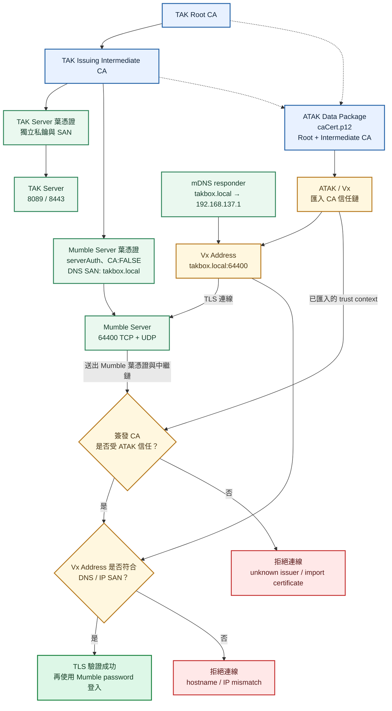

# Windows mDNS 設定

> 實機部署與驗證結果記錄於
> [Windows mDNS 驗證紀錄](docs/validation/2026-09-21-windows-mdns.md)。

這組工具在 Windows 主機的 `192.168.137.1` 介面發布：

```text
takbox.local. A 192.168.137.1
ATAK Voice._mumble._tcp.local. SRV takbox.local.:64400
TAK CoT TLS._tak-cot._tcp.local. SRV takbox.local.:8089
```

Responder 在 Windows 執行，避免 Docker Desktop／WSL2 multicast 與容器位址造成錯誤公告。Vx 手動輸入主機時主要使用 `takbox.local` 的 A record；DNS-SD service record 用於診斷及其他相容的 service browser。

## 為什麼這個架構需要 mDNS

ATAK Vx 連線 Mumble 時會建立 TLS 連線，並檢查兩個不同層次：

1. Mumble server certificate 是否能追溯到 Vx／ATAK 已信任的 CA。
2. Vx 輸入的 Address 是否與 Mumble server certificate 的 IP SAN 或 DNS SAN 完全相符。

本機測試已確認，ATAK 匯入 Data Package 後，Vx 可以使用套件內的 TAK CA 信任鏈驗證 Mumble。因此這個專案讓 TAK Server 與 Mumble Server 使用同一個私有 CA 階層：

```text
TAK Root CA
└─ TAK Issuing Intermediate CA
   ├─ TAK Server leaf certificate
   └─ Mumble Server leaf certificate
```

兩個服務只共用 CA 信任根，不共用 server certificate 或 private key。TAK 與 Mumble 各自取得用途、SAN 與金鑰都獨立的葉憑證；Mumble 葉憑證必須包含 `serverAuth` EKU，且設定 `CA:FALSE`。

ATAK Data Package 的 `caCert.p12` 包含 Root CA 與作用中的中繼 CA。ATAK 匯入後建立的 trust context 可讓 Vx 驗證由同一中繼 CA 簽發的 Mumble 葉憑證。Mumble 登入密碼仍由 `runtime/secrets/mumble_server_password` 管理，這套 CA 信任只負責 TLS server identity。

直接輸入 IP 也能通過驗證，但 Mumble 憑證必須具有相同的 IP SAN；主機 IP 改變時就要重簽憑證。`takbox.local` 提供一個在同一網段內穩定、可由 Android 解析的名稱，因此 Vx 可以固定輸入 `takbox.local`，而 Mumble 憑證固定使用 `DNS:takbox.local` SAN。

mDNS 只解決名稱解析與 SAN 比對，不會建立 CA 信任，也不會取代 TLS、Mumble password、防火牆或路由設定。

## ATAK Vx 驗證 Mumble Server 憑證流程圖



圖中的「相同 CA」是指 ATAK 已信任簽發 Mumble 葉憑證的 Root／中繼 CA。TAK Server 與 Mumble Server 不共用葉憑證或 private key。mDNS 也不會把名稱自動寫入憑證；簽發 Mumble 憑證時仍必須明確加入 `DNS:takbox.local` SAN，Vx 的 Address 也必須輸入相同名稱。

## 安裝

以系統管理員身分開啟 Windows PowerShell，從專案目錄執行：

```powershell
.\scripts\Install-WindowsMdns.ps1
```

安裝程式會：

1. 在 `runtime/mdns/.venv` 建立專用 Python virtual environment。
2. 安裝 `mdns/requirements.txt` 固定的 `zeroconf` 版本。
3. 寫入 `runtime/mdns/config.json`。
4. 建立只允許 `192.168.137.0/24` 與必要 multicast 位址的 Windows 防火牆規則。
5. 建立使用者登入時啟動的 `TAK-mDNS-Responder` 排程工作。
6. 啟動 responder 並查詢兩筆 DNS-SD service record。

`runtime/` 不提交 Git。設定不含密碼或私鑰。

## 驗證

在 Windows 執行：

```powershell
.\scripts\Test-WindowsMdns.ps1
```

在 Android 實機執行：

```powershell
adb -s <ATAK_DEVICE_ID> shell ping -c 1 takbox.local
```

預期解析為 `192.168.137.1`。解析成功後，再把 TAK server certificate 與 Mumble server certificate 的 SAN 加入：

```text
DNS:takbox.local
IP:192.168.137.1
```

DPK 的 TAK 連線可改為 `takbox.local:8089:ssl`，Vx Mumble 位址可改為 `takbox.local:64400`。

目前 `takbox.local` 的 mDNS 解析與 `64400/TCP` 連線已在 Android 實機通過。bootstrap 產生的 TAK 與 Mumble server certificate 都包含 `DNS:takbox.local` 與 `IP:192.168.137.1` SAN；Vx 可優先使用 `takbox.local`，IP 位址保留作為同一測試網段內的診斷方式。

## 移植到 Linux 與 Router／DNS 規劃

後續把 Docker Compose 移植到 Linux 時，憑證驗證條件不會改變。Vx 輸入的名稱仍必須能解析，而且必須存在於 Mumble server certificate SAN。可依網路範圍選擇下列方式：

### Linux 與 ATAK 位於同一個 Layer 2 網段

- 在 Linux host 使用 Avahi 或其他 mDNS responder 發布 `takbox.local`。
- mDNS 應由 host 發布實際 LAN IP，不應發布 Docker bridge container IP。
- 開放同一網段必要的 `5353/UDP` multicast，以及 TAK／Mumble 實際服務通訊埠。
- 保留 `DNS:takbox.local` SAN；若 IP 也可能直接用於診斷，另外保留對應 IP SAN。

### 跨 VLAN、VPN 或 Router 管理的網路

- `.local` 是 mDNS 專用名稱，不應把它當成一般 unicast DNS zone。
- 優先在 Router、內部 DNS 或 split DNS 建立一般 DNS 名稱，例如 `takbox.home.arpa` 或組織持有網域下的內部子網域。
- 由 DHCP 把正確 DNS resolver 發給 ATAK 裝置，並建立指向 Linux host 的 A／AAAA record。
- 重新簽發 TAK 與 Mumble 的獨立 server certificate，把新名稱加入各自的 DNS SAN。
- 更新 ATAK Data Package 的 TAK connect string、Vx Mumble Address、防火牆、NAT 與 VLAN 規則。
- 若仍要讓 `.local` 跨網段運作，需要 Router 的 mDNS reflector／gateway；它轉送 multicast 查詢，但不取代一般 DNS、路由或 TLS SAN。

名稱規劃完成後才簽發 server certificate。DNS 名稱變更但憑證 SAN 未同步時，即使 CA 信任鏈正確，Vx 仍會因 hostname mismatch 拒絕 Mumble 連線。

## 移除

以系統管理員身分執行：

```powershell
.\scripts\Uninstall-WindowsMdns.ps1 -RemoveRuntime
```

這會停止並刪除排程工作、移除兩條防火牆規則，以及刪除專用 runtime 目錄。

## 問題判讀

- Android 沒有送出 `5353/UDP` 查詢：檢查 VPN、Windows 行動熱點與裝置網路。
- Windows 收到查詢但沒有回覆：檢查排程工作、`runtime/mdns/responder.log` 與防火牆規則。
- Android 收到回覆但仍顯示 `unknown host`：檢查 Vx／Android resolver，核心測試先改用 `192.168.137.1`。
- mDNS 只適用同一個 link。跨 VLAN、VPN 或正式固定伺服器應改用一般 DNS。
