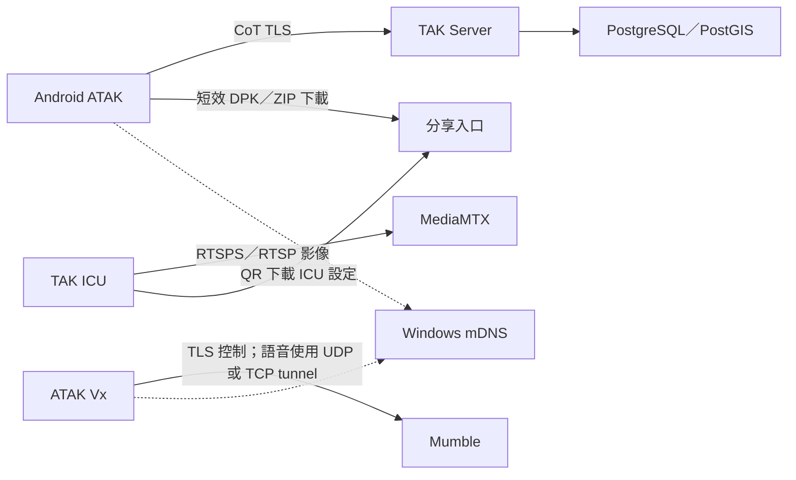

# 現行架構與驗證狀態

本頁描述 2026-09-24 專案已實作的本機部署。主要來源是 [Compose](../compose.yaml)、[bootstrap](../scripts/bootstrap_local.py) 與[驗證紀錄](validation/README.md)。

## 服務責任

| 元件 | 責任 | 現行部署 |
| --- | --- | --- |
| `tak-server` | CoT、聊天、任務、資料包與管理 API | 加入 `tak-edge` 與 `tak-backend` |
| `tak-db` | TAK 資料庫 | 僅在 internal `tak-backend`，不發布主機通訊埠 |
| `mumble` | Vx 語音及頻道 | 在 `tak-edge`，獨立於 TAK 的健康狀態 |
| `mediamtx` | RTSP／RTSPS 影像發布及讀取 | 在 `tak-edge`，獨立於 TAK 的健康狀態 |
| `media-viewer`、`media-viewer-gateway` | 受控熱點上的匿名 WebRTC 觀看及總開關 | MediaMTX viewer 留在 Compose 網路；gateway 對熱點提供 `8889/TCP` |
| `media-preview` | 供控制台登入後使用的 WebRTC 即時預覽 | 僅在 Compose 網路內，由 `share-admin` 同來源轉送 |
| `share-public` | Flask 短效檔案下載與 QR 頁 | `sharing` profile，僅綁定熱點 IP；本機 `.env` 映射 TCP 10065 |
| `share-admin` | Flask 分享、引導佈建、MediaMTX、Mumble 與用戶端憑證管理頁 | 預設 Compose 服務，自動重啟；本機 `.env` 映射 Windows `127.0.0.1:10066` |
| Windows Mumble 管理程式 | 使用 Mumble 原生協定管理 session 與註冊身分，重建 Mumble | 登入後排程工作；Flask 容器不持有 Docker socket |
| `mumble-db-helper` | 透過 `mumble-data` volume 唯讀列出註冊及製作 SQLite 一致性備份 | 按需啟動的 Compose 維護容器，沒有網路 |
| Windows TAK 憑證管理程式 | 操作中繼 CA、TAK API、共用驗證檔、DPK 與 CRL | 登入後排程工作；CA 私鑰與 Docker socket 不掛進 Flask 容器 |
| Windows mDNS responder | 將固定名稱解析到主機 LAN IP | 在 Windows 執行，不公告 Docker bridge IP |

TAK 等待資料庫健康後啟動。Windows 防火牆限制 LAN 存取；Docker Desktop／WSL2 執行 Linux 容器。專案設定以 Windows 路徑掛載，資料庫與 Mumble 資料儲存在 Docker named volume；原始計畫的全 WSL 檔案系統布局未直接套用。

## 憑證與身分

本專案必須使用 Root CA → 中繼 CA → 葉憑證的簽發階層。TAK、Mumble 與 MediaMTX 使用同一 CA 階層下的獨立伺服器憑證與私鑰；MediaMTX 的純 RTSP 入口沒有 TLS。

Vx 檢查 Mumble 憑證的信任鏈及 SAN。mDNS 負責名稱解析；伺服器憑證通過檢查後，再進行 Mumble 使用者驗證。TAK client certificate 與 Mumble 註冊身分分開管理，見[憑證](security/certificates.md)與[Mumble 使用者](mumble/users.md)。

TAK 用戶端群組的日常讀寫使用 5.8 管理 API；新憑證的指紋綁定寫入 bind mount 的 `UserAuthenticationFile.xml`，重啟 TAK 後由 API 讀回。`UserManager.jar` 只保留在首次初始化及人工修復流程。CRL 發布仍需重啟 TAK；Mumble 的 session／註冊管理走原生協定，資料庫清單與備份走共用 volume。控制台不執行 `docker compose exec`。

## 已完成與待驗項目

- 已驗證：TAK 憑證連線、TAK client CRL 撤銷測試、mDNS、Mumble TLS 與頻道登入。
- 已驗證：現行四頻道 Vx-only 套件從 TAK Server 下載後建立任務，Primary／Alternate／Medical／Emergency 均能加入；Primary／Alternate 亦曾同時維持兩條獨立連線。一般 ATAK QR 匯入同一 Vx DPK 不會建立 Mission。
- 已驗證：MediaMTX RTSP／RTSPS TCP 及 Compose 內 UDP 發布／讀取；TAK ICU 7.5.1 經 RTSPS 與帳密發布，獨立用戶端成功讀取影像。
- 已驗證：分享頁的時間／次數先到停止、QR 與檔案下載；引導頁的批次憑證、Vx 伺服器端替換、ICU QR 及 MediaMTX 小隊發布身分。Flask 管理頁能列出 Mumble session 與註冊身分；管理頁異動操作尚未對真實 Vx 身分執行。
- 已驗證：Android ICU 經 RTSPS 發布 `live/alpha/1/VIDEO_1`，Chrome 由控制台預覽與熱點 WebRTC 入口觀看；公開觀看開關及工作階段數量會更新。網際網路入口尚未建置。
- 使用者回報：手機上的 Vx 雙頻道語音測試成功。雙向 PTT 按鍵對應、實際 UDP 路徑與音訊品質尚未留下可核對的測試紀錄；同 UUID 任務重複下載的覆寫／去重行為仍待驗。
- 已驗：ATAK 5.7.0.15 手動 RTSP 來源使用讀取帳密與 Reliable／TCP，可觀看 ICU 發布的影像；自動 RTSPS 通告無法直接播放。待驗 MediaMTX 跨網路 UDP、其他 ATAK 版本與 ICU 憑證拒絕行為。
- 尚未實作：公開 8446／ACME、Linux 遷移與 Federation Hub，見[後續計畫](plans/roadmap.md)。

TAK hardened 套件的範圍是 TAK 與資料庫，不能據此宣稱 Mumble 或整個 Windows 主機也符合相同強化基準。
