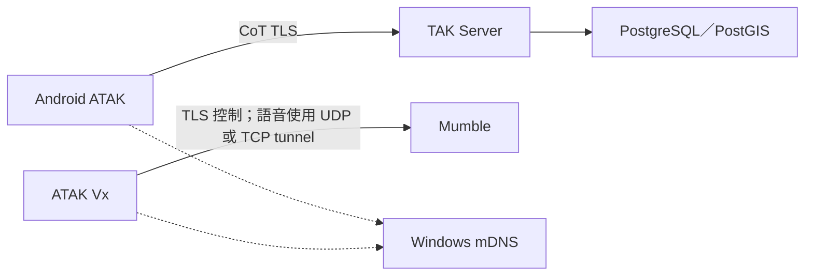

# 現行架構與驗證狀態

本頁描述 2026-09-22 專案已實作的本機部署。主要來源是 [Compose](../compose.yaml)、[bootstrap](../scripts/bootstrap_local.py) 與[驗證紀錄](validation/README.md)。

## 服務責任

| 元件 | 責任 | 現行部署 |
| --- | --- | --- |
| `tak-server` | CoT、聊天、任務、資料包與管理 API | 加入 `tak-edge` 與 `tak-backend` |
| `tak-db` | TAK 資料庫 | 僅在 internal `tak-backend`，不發布主機通訊埠 |
| `mumble` | Vx 語音及頻道 | 在 `tak-edge`，獨立於 TAK 的健康狀態 |
| Windows mDNS responder | 將固定名稱解析到主機 LAN IP | 在 Windows 執行，不公告 Docker bridge IP |

TAK 等待資料庫健康後啟動。Windows 防火牆限制 LAN 存取；Docker Desktop／WSL2 執行 Linux 容器。專案設定以 Windows 路徑掛載，資料庫與 Mumble 資料儲存在 Docker named volume；原始計畫的全 WSL 檔案系統布局未直接套用。

## 憑證與身分

本專案必須使用 Root CA → 中繼 CA → 葉憑證的簽發階層。TAK 與 Mumble 使用同一 CA 階層下的獨立伺服器憑證與私鑰。

Vx 檢查 Mumble 憑證的信任鏈及 SAN。mDNS 負責名稱解析；伺服器憑證通過檢查後，再進行 Mumble 使用者驗證。TAK client certificate 與 Mumble 註冊身分分開管理，見[憑證](security/certificates.md)與[Mumble 使用者](mumble/users.md)。

## 已完成與待驗項目

- 已驗證：TAK 憑證連線、TAK client CRL 撤銷測試、mDNS、Mumble TLS 與頻道登入。
- 已驗證：Vx-only 套件從 TAK Server 下載後建立任務；Primary／Alternate 可同時維持兩條獨立連線。
- 待驗：雙向 PTT、UDP 音訊品質、同 UUID 任務重複下載的覆寫／去重行為。
- 尚未實作：MediaMTX、公開 8446／ACME、Linux 遷移與 Federation Hub，見[後續計畫](plans/roadmap.md)。

TAK hardened 套件的範圍是 TAK 與資料庫，不能據此宣稱 Mumble 或整個 Windows 主機也符合相同強化基準。
