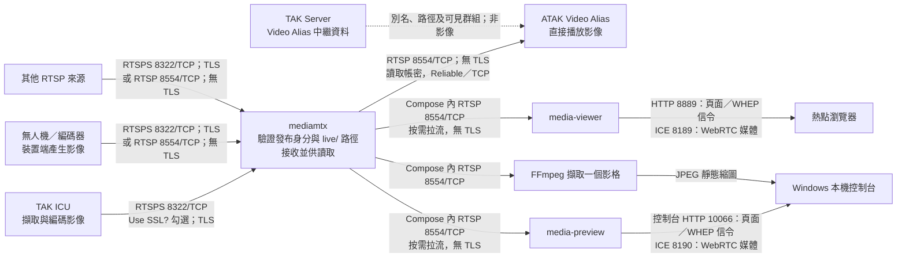

# 本機影像處理與流向

本頁描述目前 `tak-server-docker` 的本機 Compose 部署。影像來源直接發布到 `mediamtx`；TAK Server 可交付 Video Alias 等影像**中繼資料**，但不承載或轉送影像位元流。以下通訊埠是 `takbox.local` 的本機範例；主機綁定位址由 `.env` 的 `TAK_BIND_IP` 決定。

圖中的公開 WebRTC 路徑先經 `media-viewer-gateway` 的觀看開關，再由 `media-viewer` 讀取影像；控制台即時預覽則由 `share-admin` 代理到獨立的 `media-preview`。兩者的 HTTP 頁面／WHEP 信令目前**沒有 HTTPS**，WebRTC 媒體本身使用 DTLS-SRTP 加密。公開入口限本機區域網路，控制台僅綁定 Windows loopback；不能把 HTTP 頁面誤認成已完成網際網路 HTTPS 部署。

## 影像處理步驟

1. **擷取與編碼：**ICU 使用裝置相機產生影像，無人機或編碼器由設備端輸出影像。ICU 小隊路徑如 `live/alpha/1/VIDEO_1`；一般設備使用建立身分時指定的完整 `live/...` 路徑，不會自動附加 `VIDEO_1`。
2. **發布與授權：**來源以專屬發布帳密連到 `mediamtx`。ICU 的 `Use SSL?` 勾選時使用 RTSPS `8322/TCP`；一般設備可選 RTSPS，受控區域網路內也可用沒有 TLS 的 RTSP `8554/TCP`。`mediamtx` 驗證帳密和允許的路徑，再讓讀取端取得已發布的串流。
3. **讀取與播放：**ATAK 的本機實測路徑是使用讀取帳密，直接經 RTSP `8554/TCP` 播放；需在 ATAK 勾選 **Reliable P2P Connection**。瀏覽器則由 `media-viewer` 或 `media-preview` 在 Compose 網路內按需從 `mediamtx` 拉取 RTSP，對外提供 WebRTC；`8889`／`10066` 是頁面及信令，`8189`／`8190` 是 ICE 媒體連線。播放端須支援來源編碼。
4. **縮圖：**「ICU」與「其他」管理頁另以 FFmpeg 從內部 RTSP 讀取一個影格，轉成 JPEG 後結束讀取。縮圖是靜態圖片，不會長時間維持 WebRTC 工作階段；「放大預覽」及監視器模式才建立即時 WebRTC 連線。

## 每段協定與加密狀態

| 連線 | 協定與通訊埠 | TLS／媒體加密 | 現況 |
| --- | --- | --- | --- |
| TAK ICU → `mediamtx` | RTSPS `8322/TCP` | TLS；ICU 介面勾選 `Use SSL?` | Android ICU 7.5.1 已驗證發布。ICU 的純 RTSP 測試曾逾時，不能當作已驗證的備援路徑。 |
| 無人機／其他設備 → `mediamtx` | 優先 RTSPS `8322/TCP`；也接受 RTSP `8554/TCP` | RTSPS 有 TLS；RTSP 無 TLS | FFmpeg 模擬無人機兩種方式已驗證；實體無人機尚未驗收。 |
| `mediamtx` → ATAK | RTSP `8554/TCP`，讀取帳密 | 無 TLS | ATAK CIV 5.7.0.15 的手動 Video Alias 與 Reliable／TCP 已實測；ICU 自動 RTSPS 通告在該版本無法直接播放。 |
| `mediamtx` → WebRTC viewer／preview | Compose 內 RTSP `8554/TCP`，按需拉流 | 無 TLS；僅走 Compose 網路 | viewer 與 preview 為兩個獨立的 MediaMTX 容器。 |
| `media-viewer-gateway`／`media-viewer` → 熱點瀏覽器 | HTTP／WHEP `8889/TCP` 信令；ICE `8189/TCP,UDP` 媒體 | HTTP 無 TLS；WebRTC 媒體為 DTLS-SRTP | 已驗證熱點觀看；網際網路入口未建置。 |
| `share-admin`／`media-preview` → Windows 本機瀏覽器 | HTTP／WHEP `127.0.0.1:10066/TCP` 信令；ICE `127.0.0.1:8190/TCP,UDP` 媒體 | HTTP 無 TLS；WebRTC 媒體為 DTLS-SRTP | 控制台預覽與監視器模式使用這條路徑。 |
| `mediamtx` → FFmpeg → 管理頁縮圖 | Compose 內 RTSP `8554/TCP` → JPEG／HTTP `127.0.0.1:10066` | RTSP 與 HTTP 均無 TLS；僅限內部／本機 | 每次擷取單一影格並快取，不是持續播放。 |

RTSPS 使用 MediaMTX 專用伺服器憑證；發布／讀取帳密負責授權，兩者用途不同。純 RTSP 與內部 RTSP 段均不使用 TLS。完整通訊埠及防火牆範圍見[通訊埠與連線方向](../network/ports-and-protocols.md)。

MediaMTX 也映射 RTSP 的 RTP／RTCP `8000-8001/UDP`，以及 RTSPS 的 SRTP／SRTCP `8004-8005/UDP`；表格列出的本機成功案例主要使用 TCP。Docker Desktop 跨網路的 UDP 媒體路徑尚不能視為實機驗收通過。

2026-09-30 雲端另確認：ICU SSL 發布的實際人物 CoT 連結使用 `rtsps`，ATAK 5.7.0.15 將其解析成 `raw` 並顯示 `Failed to Connect`；同一連結使用原帳密的公開 RTSPS `DESCRIBE` 已回應 `200 OK`。詳見[SSL 相容性實測](../validation/2026-09-30-icu-ssl-atak-rtsps.md)。

本機實測範圍與限制見[ICU 與 ATAK 觀看紀錄](../validation/2026-09-25-atak-icu-viewer.md)、[模擬無人機紀錄](../validation/2026-09-25-drone-synthetic-stream.md)及[監視器模式紀錄](../validation/2026-09-29-media-wall.md)。
