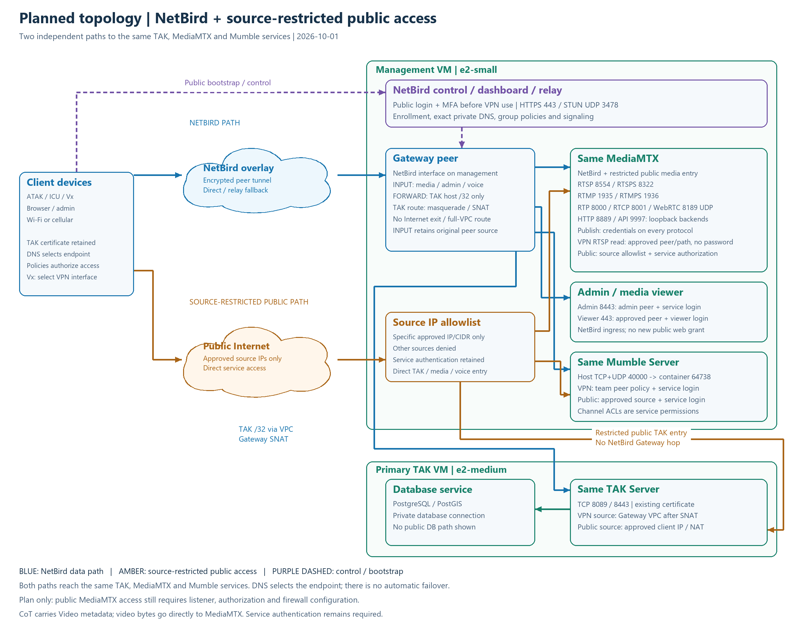

# NetBird and Source-Restricted Public Access: Planned Network Topology

Plan revised: 2026-10-01 (Asia/Taipei). The diagram proposes two independent paths to the same TAK, MediaMTX and Mumble services: NetBird and public service endpoints restricted to specific approved source IPs/CIDRs. The drawing update does not apply cloud firewall, listener or authorization changes. MediaMTX currently remains bound to NetBird, as confirmed in the device/server recheck below. Service names and boundaries are generic; no actual addresses, personal identities or credentials are included.



[SVG](diagrams/netbird-dual-path-topology.svg) · [Editable Mermaid](diagrams/netbird-dual-path-topology.mmd)

## Read the paths

- **Blue:** an enrolled client uses an encrypted NetBird peer tunnel to the Gateway. Direct connectivity is preferred; relay is used when necessary.
- **Amber:** a client uses public service endpoints only from an explicitly approved source IP/CIDR. Other sources are denied at the public ingress; service authentication and operation/path authorization still apply. This path bypasses the NetBird Gateway.
- **Dashed purple:** public NetBird bootstrap, login/MFA and control signaling. Bootstrap must work before the VPN connects.
- **Green:** service and private database boundaries. Arrows show connection initiation; responses use the established session. The drawing is logical rather than a packet capture.

The Management VM contains NetBird control/relay, the Gateway peer, protected web applications, MediaMTX and Mumble. The Primary TAK VM contains TAK and PostgreSQL/PostGIS. The two proposed paths terminate at the **same** TAK, MediaMTX and Mumble services; they do not represent duplicated deployments or automatic failover. The allowlist symbol represents ingress checks on each VM's public service entry, not a shared forwarding server. Admin/viewer web grants and the private database are outside the new direct-public service scope.

## Proposed direct-public access

| Service | Restricted public entry | Authentication retained |
| --- | --- | --- |
| TAK | Primary public endpoint, TCP `8089/8443`; approved source IP/CIDR only | Existing TAK client certificate |
| MediaMTX | Management public media endpoint, approved source IP/CIDR and enabled protocol/port only | Publishing credentials on every protocol; explicit service/action/path authorization for public access |
| Mumble / Vx | Management public endpoint, TCP+UDP `40000`; approved source IP/CIDR only | Mumble identity/password and channel ACLs |

NetBird remains an independent entry with its peer/group policies. Its authorized plain RTSP viewing exception does not automatically extend to public clients. Source-IP permission alone does not grant stream publication, cross-team media access or voice channel access. Public source checks see the client's egress/NAT address; service authorization must distinguish this source from an enrolled NetBird peer.

Before applying this plan, configure MediaMTX listeners for both intended interfaces and add an explicit public-ingress authorization rule. A firewall allowlist alone cannot make the current NetBird-bound listener reachable or authorize a public client. Keep HTTP/API backends on loopback and leave unrelated public management endpoints outside this change.

## Observed access and identity before this plan

| Service | NetBird path | Retained public path | Application identity |
| --- | --- | --- | --- |
| TAK CoT / package API | Gateway FORWARD policy, one private host `/32`, TCP `8089/8443`, VPC masquerade/SNAT | Direct public TAK entry; original Primary firewall/login rules | Existing TAK client certificate on either path |
| Mumble / ATAK Vx | Gateway INPUT policy, team peers, host TCP+UDP `40000` | Existing public binding and firewall rules; no NetBird Gateway hop | Mumble identity/password and channel ACLs on either path |
| MediaMTX publication / playback | Gateway NetBird media listeners; peer, operation and exact-path authorization | Current media listeners bind to the NetBird address | Every publication needs credentials; approved plain RTSP reads need no password; protected reads retain credentials/session grants |
| Admin / media viewer | Approved peers reach Nginx; admin `8443`, viewer `443`; applications on loopback | Public NetBird bootstrap on `443` remains separate from protected media vhosts | Admin service login or viewer login plus peer ingress authorization |

TAK sees the Gateway VPC source after VPN route SNAT. Local media/admin/Mumble services see the original NetBird peer source and can apply peer/group checks. Legacy public connections follow their existing source/NAT and firewall rules. DNS selects the destination; the policy authorizes access rather than automatically selecting another route.

## DNS, media and operational limits

Keep the supplied service hostname and certificate SAN. Authorized NetBird peers receive exact private DNS: TAK resolves to its private VPC host, while media/voice/admin resolve to the Gateway NetBird address. Admin DNS is limited to approved admin peers. Legacy access depends on public resolution or the existing client endpoint settings; DNS distribution alone grants no access.

ICU publication and ATAK viewing use the same complete active stream path. ATAK's accepted person-marker Video flow uses plain RTSP `8554` inside NetBird. The tunnel is encrypted, but RTSP itself has no TLS. The tested ATAK version's automatic RTSPS incompatibility remains relevant. Vx also needs its active VPN interface selected through long-press `Network`.

NetBird group removal blocks the corresponding VPN grants; the retained public entry still follows its separate firewall and application identity rules. Certificate revocation, Mumble access and channel ACLs therefore need their own lifecycle controls. Full team-specific Mumble channel ACL rollout remains pending.

TAK carries CoT/Video metadata, while MediaMTX carries video bytes. Signed package downloads can use direct HTTPS outside the overlay. They are not a second TAK route or proof of VPN service access. The ICU checks below confirm the current media boundary; legacy TAK/Mumble reachability, uninterrupted handover and automatic fallback were not retested for this drawing.

## Can an old ICU profile or stream path still work?

Existing registered stream paths have not been rotated as part of the NetBird rollout. A previous ICU path can remain valid when the current account still has publication permission for that exact path. This is separate from how the client reaches the server.

An old profile can work through NetBird if its supplied hostname resolves to the Gateway, the publishing credentials/path remain valid, and its protocol/port match the current listener. A former direct-public-IP endpoint does not become an alternate media entry: the current media listeners bind to the NetBird address. Reissue the profile if its endpoint, credentials or assigned path have changed. For the accepted ATAK Video workflow, ICU uses plain RTSP with publishing credentials and ATAK reads the same permitted active path without a viewing password.

### Device and live-server recheck

On 2026-10-01, the operator confirmed that ICU publication still required NetBird. An ADB check of the unlocked device showed broadcasting enabled, plain RTSP `8554`, the previous complete stream path unchanged, and a VPN tunnel interface present. The displayed Video URL does not expose publishing credentials; its presentation alone is not evidence of anonymous publication.

A read-only SSH check confirmed that MediaMTX uses host networking, with RTSP `8554`, RTSPS `8322`, RTMP `1935`, RTMPS `1936`, RTP/RTCP `8000/8001` and WebRTC UDP `8189` configured on the Gateway NetBird address. WebRTC HTTP `8889` and the authenticated API `9997` remain on loopback. An authenticated local API check found the previous path ready with H264/KLV tracks, one RTSP publisher from a NetBird source, and increasing received bytes during a five-second observation. No reader was active during that observation, so it was a publication check rather than a new ATAK playback acceptance.

A TCP probe to the Management VM's public address on `8554` did not connect. Together with the current listener configuration and device observation, this supports keeping media on the NetBird path. It does not prove the status of every historical endpoint or network source. Existing path compatibility does not restore the former public media entry.

## Source and reproduction

- [Route/DNS/policy details](netbird-routing.md)
- [NetBird user workflow](netbird-user-guide.md)
- [Device observations and acceptance limits](../validation/2026-10-01-netbird-tak-media-voice.md)

Regenerate the Mermaid description and deterministic SVG/PNG layout from the repository root:

```powershell
python scripts/render_netbird_network_diagrams.py
```

The Mermaid topology and exported layout are both maintained in [the renderer](../../scripts/render_netbird_network_diagrams.py). PNGs are generated without source screenshot metadata.
