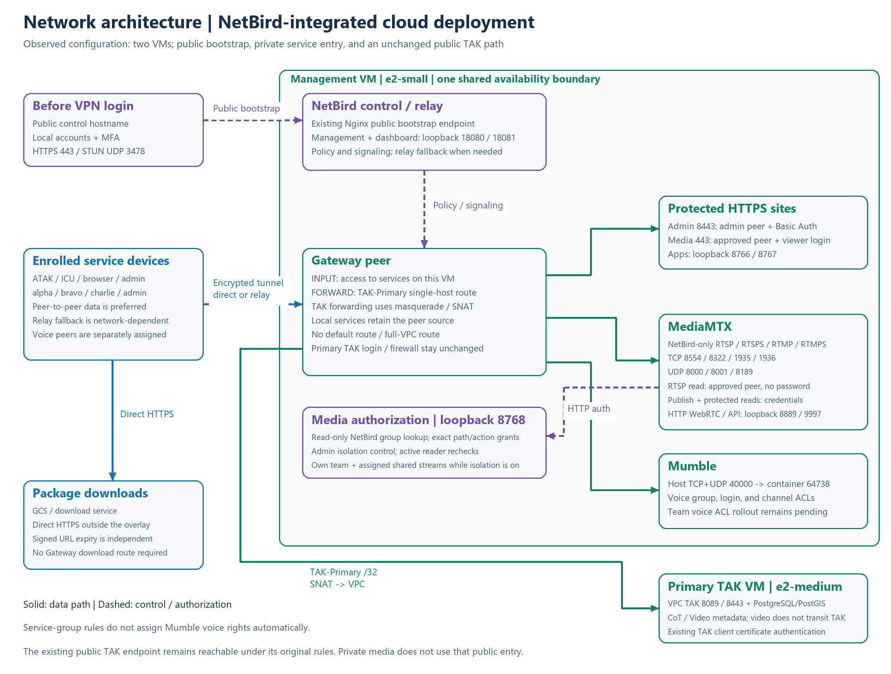
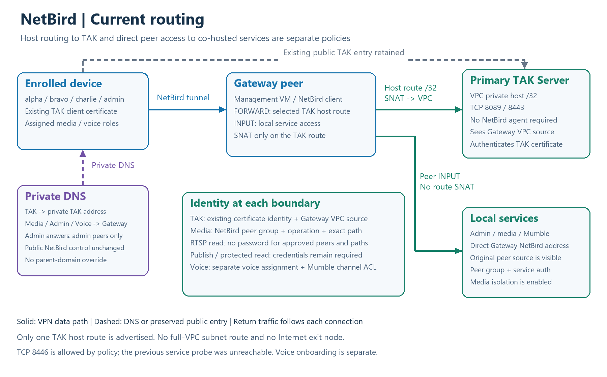

# NetBird Routing and Cloud Network Architecture

Observed deployment model: 2026-10-01. This is a sanitized description of a separate two-VM cloud deployment. The local Compose implementation in this repository is documented in [architecture](../architecture.md) and [local video flow](../mediamtx/video-flow.md). This page does not imply that Compose installs NetBird or applies the cloud policies automatically.

## Network architecture



[SVG](diagrams/network-architecture.svg) · [Editable Mermaid](diagrams/network-architecture.mmd)

One management VM hosts NetBird control, dashboard, relay/STUN, the Gateway peer, Nginx, admin/media applications, MediaMTX authorization, MediaMTX, and Mumble. It uses `e2-small`; all of those services share availability and capacity. A separate `e2-medium` VM hosts TAK and PostgreSQL/PostGIS. A previously separate NetBird VM is no longer part of the topology.

The public NetBird endpoint must work before VPN login. Local accounts and MFA protect login. Enrolled devices use encrypted peer tunnels: direct connectivity is preferred, with relay fallback when needed. Enrollment alone does not establish whether a particular session is direct or relayed. TAK distributes CoT/Video metadata; video bytes flow directly between devices and MediaMTX.

## Current routing



[SVG](diagrams/netbird-routing.svg) · [Editable Mermaid](diagrams/netbird-routing.mmd)

| Destination | Route and policy | Source seen by destination | Application identity |
| --- | --- | --- | --- |
| Primary TAK private address | One enabled host `/32` resource through the Gateway; FORWARD policy and masquerade/SNAT | Gateway VPC address | Existing TAK client certificate |
| Services on the management VM | Direct Gateway NetBird address; INPUT peer policy | Original NetBird peer address | Media authorization, service login, or Mumble identity |
| Private package storage/download service | Direct HTTPS outside the VPN route | Normal download connection source | Signed URL or download-service controls |

There is no whole-VPC route, Internet exit node, or permanent source-preserving return route. Cloud IP forwarding is enabled on management and disabled on primary TAK; this setting alone does not advertise a route or authorize a peer. Existing primary TAK login and firewall rules remain in place, including the original public TAK entry. Removing VPN access does not revoke an existing TAK certificate or that separate public entry.

### Private DNS and TLS

The names below are placeholders, not live deployment endpoints.

| Exact service name | Answer for authorized VPN peers | DNS recipients |
| --- | --- | --- |
| `tak.example.test` | Primary TAK VPC address | Team/admin groups and existing pilot administrators |
| `media.example.test` | Gateway NetBird address | Team/admin groups and existing pilot administrators |
| `voice.example.test` | Gateway NetBird address | Team/admin groups and existing pilot administrators |
| `admin.example.test` | Gateway NetBird address | Admin and existing pilot administrators only |
| `netbird.example.test` | Public bootstrap endpoint | Must resolve before VPN login |

Use exact-name overrides, not a parent-domain override. DNS recipients and traffic permissions are separate. Package/download resolution is unchanged. A local loopback mapping for the co-hosted Gateway's own control hostname must not be distributed to clients. Existing service hostnames and certificate SANs are retained; plain RTSP has no TLS, while NetBird encrypts its tunnel transport.

## Service access matrix

| Service | Transport / listener | Authorization boundary |
| --- | --- | --- |
| NetBird bootstrap | Public HTTPS `443/TCP`, STUN `3478/UDP` | Login/MFA, enrollment and explicit policies |
| TAK | Primary VPC `8089/8443/TCP` | Host resource policy plus existing client certificate |
| TAK policy-only entry | Primary VPC `8446/TCP` | Permission exists; previous service probe was unreachable |
| Admin | Gateway HTTPS `8443`; app loopback `8766` | Admin/pilot-admin peer permission plus Basic Auth |
| Media viewer | Gateway HTTPS `443`; app loopback `8767` | Eligible peer plus viewer login and ingress authorization |
| RTSP / RTSPS | Gateway NetBird `8554/8322/TCP` | Eligible peer, operation and exact active path |
| RTMP / RTMPS | Gateway NetBird `1935/1936/TCP` | Eligible peer plus credentials |
| RTP / RTCP / WebRTC | Gateway NetBird `8000/8001/8189/UDP` | Media policy plus session authorization |
| Media HTTP / API | Loopback `8889/9997` | Authenticated WebRTC proxy / internal maintenance |
| Media authorization | Loopback `8768` | Trusted local callbacks, read-only NetBird directory lookup |
| Mumble | Host `40000/TCP+UDP` to container `64738` | Separate voice assignment, service login and channel ACLs |

NetBird control/dashboard HTTP backends bind to loopback `18080/18081`. Public bootstrap and protected media share Nginx port `443`, so port policies alone cannot distinguish those vhosts. Nginx and application checks protect the media site. MediaMTX media listeners bind to the Gateway NetBird address; internal APIs are not peer-facing. Mumble's legacy public binding remains, so voice is not yet wholly VPN-only.

### Team and protocol rules

- Explicit `alpha`, `bravo`, `charlie`, and `admin` policies authorize selected TAK/media transports; admin additionally receives the console port. The default `All -> All` policy has been removed.
- Legacy role policies remain and have different port sets. In particular, the team media policy includes RTMP `1935`; the legacy pilot-admin TCP policy does not. Do not infer identical permissions from different memberships.
- **Media isolation is enabled:** own team plus explicitly assigned shared streams; approved admins have cross-team viewing. Turning isolation off permits cross-team viewing for eligible peers and known enabled paths, while publication and protected-protocol authentication remain unchanged.
- **Plain RTSP reads require no password** when the NetBird peer and exact active path are authorized. **Every publication requires credentials**, including RTSP. RTSPS, RTMP, RTMPS, and WebRTC reads retain credentials or an authenticated browser grant.
- The deployed MediaMTX build distinguishes RTSP and RTSPS at the listener before its HTTP authorization callback. Group, operation, and exact path checks therefore remain protocol-specific. Peer-directory lookup and reader rechecks use an approximately five-second interval; reader removal preserves publishers.
- Team membership alone does not grant Mumble ingress. A separate voice group or existing pilot-admin policy is required. Full team-specific voice ACL rollout remains pending.
- Random-token paths, member/token inventory, and coordinated QR/URL/DPK rotation with old-link removal remain planned. Existing registered paths have not been migrated by this documentation update.

## Verification and remaining work

The current configuration was checked through route/resource/router policies, exact DNS records, VM inventory, service state, and listener bindings. Actual same-team ICU publication and ATAK person-marker RTSP viewing without credentials were accepted on devices. Protocol checks also established RTSP media delivery and anonymous RTSPS denial with authenticated RTSPS success.

Cross-team phone denial, broader enrollment, mobile reconnection, team voice ACLs, and multi-viewer/relay load remain separate acceptance gates. The management VM size is an initial trial configuration, not a capacity guarantee. A point-in-time snapshot without ready streams does not invalidate the earlier playback acceptance.

## Diagram maintenance

The images contain generic labels only. Mermaid files describe the topology; the renderer separately defines the SVG/PNG layout. Update both sources in [the renderer](../../scripts/render_netbird_network_diagrams.py), then regenerate from the repository root:

```powershell
python scripts/render_netbird_network_diagrams.py
```

Pillow is required by the existing diagram helper. For a non-Windows font setup, pass `--font-dir` containing `DejaVuSans.ttf` and `DejaVuSans-Bold.ttf`. Exported files contain no actual deployment addresses, account identities, credential-bearing URLs, or runtime evidence.
