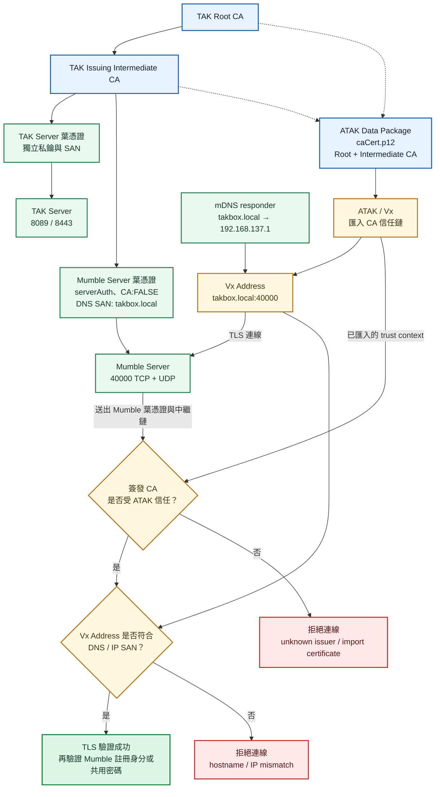

# 憑證、信任鏈與 CRL

本機部署必須保留中繼簽發 CA。Root CA 簽中繼 CA，中繼 CA 簽發 TAK、Mumble、MediaMTX、管理員及裝置的獨立葉憑證。TAK／Mumble 憑證由 [bootstrap](../../scripts/bootstrap_local.py) 產生，MediaMTX 由[獨立簽發腳本](../../scripts/provision_mediamtx.py)產生；檔案用途見[runtime 參考](../reference/runtime-layout.md)。

## 簽發與匯入原則

實作參考官方 hardened 套件 `tak/certs/makeRootCa.sh`、`makeCert.sh`（包括 `makeCert.sh ca`）的憑證用途、鏈與 truststore 組成原則。腳本以 OpenSSL／keytool 自行產生，不是直接執行這兩個上游腳本。

- Root CA 為 `CA:TRUE, pathlen:1`；中繼 CA 為 `CA:TRUE, pathlen:0`。
- TAK 與 Mumble 使用各自的葉憑證及私鑰；Mumble 葉憑證為 `CA:FALSE`，具有 `serverAuth` EKU。
- bootstrap 必須明確指定 `--host`（或 `--dns`）、`--ip` 至少一項；只填 DNS 產生 DNS-only，只填 IP 產生 IP-only，兩者都填則產生 DNS＋IP。DNS 存在時優先作為 CN 與 DPK 連線名稱；參數不會修改網路設定。本專案教學採用固定 DNS 名稱，讓 IP 可變動。
- ATAK `caCert.p12` 與 TAK truststore 包含 Root 及作用中的中繼 CA。裝置 `clientCert.p12` 包含裝置私鑰及憑證鏈。
- Mumble `mumble-fullchain.pem` 為葉憑證加中繼 CA；不把 Root CA 加入伺服器送出的鏈。
- MediaMTX 也使用獨立 `serverAuth` 葉憑證、私鑰與葉憑證加中繼 CA 的 fullchain。其私鑰未加密，僅放在忽略版控的 runtime 並唯讀掛載；不與 TAK／Mumble 共用私鑰。RTSP 不使用此憑證，RTSPS 才會使用。
- CA 私鑰留在受控簽發環境；常駐容器不掛載 CA 私鑰。本機 `runtime/pki/private/` 仍須另行保護及備份。

## Vx 驗證 Mumble 的範圍

本次 ATAK／Vx 版本已實測：Vx 可利用 ATAK 個別 TAK Server 設定匯入的 CA 信任資料，驗證同一 CA 階層簽發的 Mumble 憑證。這是本專案採用同一中繼 CA 的理由；不是 Mumble 協定要求所有部署都必須使用 TAK CA。

TAK DPK 設定是指定連線的憑證設定，詳見[ATAK 連線](../atak/connection.md)。Vx 的信任整合不能推論為 Android 所有 App 都信任此 CA，也不保證其他 ATAK／Vx 版本行為相同。

### SAN 依連線位址選擇 DNS 或 IP

2026-09-22 已分別換用 DNS-only、IP-only Mumble 葉憑證，並由使用者確認 Vx 的 P1／A1 都能重新登入及加入頻道。**SAN 不必同時含 DNS 與 IP；應包含 Vx Address 實際使用的名稱或位址。**

| Vx Address | Mumble 葉憑證 SAN | 名稱解析需求 |
| --- | --- | --- |
| `takbox.local` | `DNS:takbox.local` 即可 | mDNS 能解析到主機 IP |
| `192.168.137.1` | `IP:192.168.137.1` 即可 | 此 Mumble 連線不需要 mDNS／DNS |
| 兩種入口都要提供 | 同時加入上述 DNS 與 IP SAN | 使用名稱的用戶端仍需要名稱解析 |

IP 要使用 `IP:` 類型，不能以 `DNS:192.168.137.1` 取代。通訊埠 `40000` 填在 Vx Port，不放入 SAN。固定 DNS 名稱可在 IP 改變後沿用憑證；直接以 IP 連線時，IP 改變就要重新簽發含新 IP SAN 的憑證，並更新 Vx Address。

以上實測保留同一 CA、私鑰與 `CN=takbox.local`。APK 的信任流程有 Android、TAK 及自訂 fallback 分支；自訂分支接受符合 host 的 DNS 或 IP SAN，也有 CN fallback。本次正向測試證明兩種 SAN 配置可用，沒有證明各分支對不相符 SAN 都會拒絕；部署仍應使用相符 SAN，不依賴 CN fallback。完整範圍見[單一類型 SAN 實測](../validation/2026-09-22-mumble-san.md)。

以下圖示以 DNS 入口為例，表示部署時應符合的信任與位址條件，不逐一表示 APK 的內部分支。



部署應同時具備受信任的 CA 鏈及與 Address 相符的 SAN。mDNS 只提供名稱解析，不會替憑證增加 SAN，也不會建立信任。Mumble 的共用密碼、Vx 自行管理的用戶端憑證與註冊身分，是 TLS 伺服器驗證後的另一層機制，見[Mumble 使用者](../mumble/users.md)。

## 啟用撤銷檢查

目前 `CoreConfig.xml` 的 `auth` 設定 `x509checkRevocation="true"`；`security/tls/crl` 分別列出作用中中繼 CA、舊中繼 CA 與 Root CA 的 CRL，供 CoT/TLS 8089 使用。**Root CRL 記錄中繼 CA 的撤銷；簽發中繼 CA 的 CRL 記錄它簽發的葉憑證撤銷。**兩層各有用途，不能只以其中一份代表整條鏈已完成停權驗證。目前 8443 的 `network/connector` 未設定 `crlFile`；先前啟用此屬性的測試保留於[驗證紀錄](../validation/2026-09-23-tak-crl-8443.md)，不代表現在的 8443 已啟用 TLS 層 CRL 檢查。`x509checkRevocation` 是 TAK Client Certificates 的應用層檢查，不能代替 8443 connector 的 CRL 設定。

撤銷**中繼 CA** 時還須讀回 TAK 信任憑證鏈資料庫（truststore）：若舊中繼 CA 被直接列為信任錨，驗證路徑可能在它結束而不往上檢查 Root CRL。2026-09-25 實測中，僅發布 Root CRL 後 8089 仍接受舊憑證 TLS 交握；從 `truststore-root.jks` 與 `fed-truststore.jks` 移除 `tak-issuing-old`、保留 Root 與新中繼 CA 並重啟 TAK 後，8089 才拒絕舊憑證的新連線。這是 CA 輪替的信任憑證鏈資料庫處理；**平常只撤銷單張裝置葉憑證，不應移除整個簽發中繼 CA**。[實測對照](../validation/2026-09-25-ca-rotation-cutover.md)記錄了前後結果。


此設定不會自動讓 Mumble 檢查 TAK CRL，也不會取消 Mumble 註冊身分。Mumble 權限另依[使用者管理](../mumble/users.md)處理。

## 更新 CRL

需要本機 CA 資料庫、加密 CA 私鑰、對應密碼檔，以及 OpenSSL。CRL 目前有效期為 30 天；尚無自動更新排程，管理者應在 `nextUpdate` 前更新：

```powershell
python ./scripts/refresh_tak_crls.py
openssl crl -in ./runtime/tak/certs/intermediate-ca.crl.pem -noout -issuer -lastupdate -nextupdate
docker compose restart tak-server
docker compose ps
```

成功時腳本發布 Root、中繼及合併 CRL，日期更新，TAK 重新啟動後回復 healthy。若簽發失敗，先保留既有檔案並檢查 CA 設定、密碼及有效期；不要以關閉撤銷檢查解決。既有 CRL 過期時應先重新發布有效 CRL，再重新驗證用戶端。

## 撤銷特定 TAK 憑證

先核對目標公開憑證的 subject／serial，保留 CA 資料庫備份，確認是要撤銷的裝置。下列為佔位範例，應替換成目標公開 PEM；不要直接使用管理員或伺服器憑證：

```powershell
openssl x509 -in <TARGET_CERT_PEM> -noout -subject -issuer -serial
python ./scripts/revoke_tak_certificate.py <TARGET_CERT_PEM> --reason keyCompromise
docker compose restart tak-server
```

腳本將憑證加入簽發 CA 的撤銷資料庫並更新 CRL。應另外確認目標裝置的新 TLS 連線遭拒，仍有效的裝置可連線；不要只檢查既有 session。撤銷是持久的 CA 狀態變更，需要恢復連線資格時應規劃新憑證與新 DPK。

中繼 CA 遭入侵時，不能只更新葉憑證 CRL；必須移除受損 CA 的信任並更換簽發鏈及葉憑證。自動輪替、停機復原演練仍列於[後續計畫](../plans/roadmap.md)。

依據：[CRL 更新](../../scripts/refresh_tak_crls.py)、[撤銷工具](../../scripts/revoke_tak_certificate.py)、[TAK 與 DPK 實測](../validation/2026-09-21-tak-server-dpk.md)。
