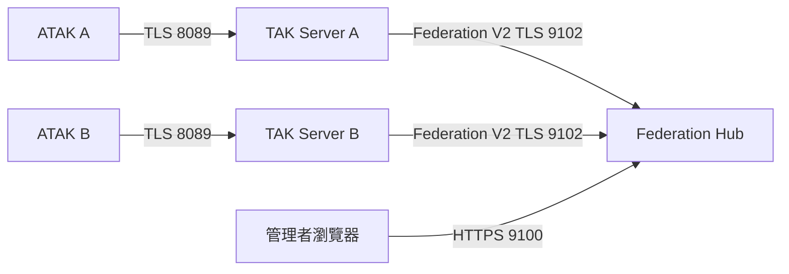
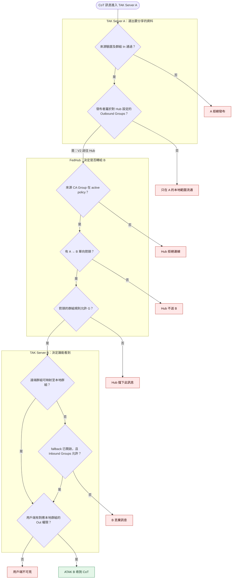

# TAK Server、Federation Hub 與 TAK 用戶端連線

本專案的 ATAK 裝置已透過 `8089/TCP` 連到本地 TAK Server；若要與另一個管理網域交換態勢資料，應讓各網域的 TAK Server 連到 Federation Hub（FedHub）。裝置仍連自己的 TAK Server，不必改連 FedHub。以下以本專案的 TAK Server `5.8-RELEASE-84` 與官方 FedHub Docker `5.8-RELEASE-84` 為準。

**目前狀態（2026-09-29）：**`compose.yaml` 只發布 TAK Server 的 `8089/TCP`、`8443/TCP`；沒有 FedHub 服務，也沒有發布 TAK federation 埠。本頁是部署設計與操作步驟，並非已完成的 FedHub 實測紀錄。文中的 `<hub-fqdn>`、`<server-fqdn>`、憑證與網段都須換成實際值。



`8443/TCP` 仍供 TAK 管理網頁、API 與 ATAK Data Packages 使用；它不是 federation 的資料通訊埠。FedHub 的 `9100/TCP` 是管理介面，TAK Server 的 outgoing federation connection 應指向 **`9102/TCP`**。另一份官方教學投影片曾將 `9100` 或 `9102` 都寫成 V2 目標；這與 5.8 FedHub 指南及套件設定不符，實際連線請使用 `9102`，並以服務監聽與連線狀態核對。

## 通訊埠與防火牆

下表以「FedHub 位於另一部主機、兩部 TAK Server 主動連 Hub」為例。防火牆規則應限縮到指定來源 IP 或網段；同機容器互連時，以 Docker 網路內的位址與通訊埠檢查，毋須為容器間流量開 Windows 對外埠。

| 方向 | 目的埠 | 用途 | 哪一端開放入站 |
| --- | --- | --- | --- |
| ATAK／WinTAK → 各自 TAK Server | `8089/TCP` | CoT TLS、用戶端憑證 | 各 TAK Server 主機；本專案已有 Compose 映射與 `Install-TakFirewall.ps1` 規則 |
| ATAK／管理者 → 各自 TAK Server | `8443/TCP` | HTTPS API、管理、Data Packages | 各 TAK Server 主機；依實際使用者來源限制 |
| TAK Server A、B → FedHub | `9102/TCP` | V2 federation，主要資料連線 | **FedHub 主機**；只允許已核准 TAK Server 的來源 IP |
| 管理者 → FedHub | `9100/TCP` | HTTPS 管理介面與憑證式登入 | **FedHub 主機**；限管理網段，或只綁 loopback 再以受控通道存取 |
| FedHub → TAK Server | TAK 設定的 V2 federation 埠，常見為 `9001/TCP` | 只有在 Hub 建立 outgoing connection，或使用 TAK Server 對 TAK Server 直連時才需要 | **被連入的 TAK Server 主機**；先在 TAK 管理介面確認實際埠，並新增 Compose 映射與防火牆規則 |

官方 FedHub `9101/TCP` 是已淘汰的 V1；新部署用 V2 時不必對外開放。官方 TAK Server 範例還出現 V1 `9000/TCP`，其 Docker 啟動範例有 `9000`／`9001` 映射；是否需要發布取決於連線方向與實際啟用的 listener。`8446/TCP` 在 TAK Server 5.8 指南中是 WebTAK/OAuth HTTPS 入口，**不是 FedHub 埠**。Token federation（例如 TAK `9002`、FedHub `9103`／`9104`）是另一種驗證模式，本頁採 X.509 mTLS，沒有要求開放這些埠。FedHub 的 MongoDB `27017/TCP` 僅在啟用 Mission Federation Disruption Tolerance（MFDT）時需要，且應留在內部網路，勿直接發布給用戶端。

若以 Compose 部署**另一部主機上的 FedHub**，下列 `ports` 片段表示管理介面只供該主機使用、V2 埠綁在聯邦網路介面。將 `<hub-bind-ip>` 換成該主機實際位址，再依來源設定主機防火牆；這不是本專案現有 `compose.yaml` 的服務。

```yaml
ports:
  - "127.0.0.1:9100:9100/tcp"
  - "<hub-bind-ip>:9102:9102/tcp"
```

本專案的 Windows TAK 防火牆腳本只建立 `8089` 與 `8443` 規則；若選擇本機 TAK Server 主動連外部 Hub，Windows 不需新增 TAK federation 入站規則，但主機與容器必須能連到 Hub 的 `9102/TCP`。若要讓 Hub 主動連入本機，還要讓對方可解析並路由到本機位址；Windows 行動熱點的 `<hotspot-ip>` 與 `.local` mDNS 名稱通常不能直接作為跨網域位址。請在可路由網路或 VPN 上使用明確 DNS、相符的伺服器憑證 SAN，並更新 `.env` 的 `TAK_BIND_IP`／`TAK_ALLOWED_SUBNET`、Compose 映射及防火牆來源範圍。

## 建議設定順序

### 1．準備 FedHub 主機與憑證

1. 使用提供的 `takserver-fedhub-docker-5.8-RELEASE-84.zip`，按其 `README_fedhub_docker.md` 建置 FedHub 映像。FedHub 是獨立服務，不會由本專案現有的 hardened TAK Server Compose 自動啟動。官方 Docker 範例將套件的 `tak/` 掛到容器 `/opt/tak`；設定檔位於 `tak/federation-hub/configs/federation-hub-broker.yml` 及 `federation-hub-ui.yml`。
2. 在 FedHub 建立自己的 CA、伺服器憑證與管理者用戶端憑證。`broker.yml` 的 `keystoreFile`、`truststoreFile`、`caFile` 與 `ui.yml` 的 `keystoreFile`、`truststoreFile`、`keyAlias` 必須對應實際檔案。FedHub 伺服器憑證的 SAN 應包含 TAK Server 用來連線的 `<hub-fqdn>`。不要把教學檔中的預設密碼直接用於部署。
3. 依官方 `federation-hub-manager.jar` 程序，將管理者憑證加入 `authorized_users.yml`，並確認 `ui.yml` 的 `authUsers` 路徑。管理者用該憑證登入 `https://<hub-fqdn>:9100/index.html`。Docker 發布埠與主機防火牆都須允許預定管理來源到 `9100/TCP`、指定 TAK Server 到 `9102/TCP`；不使用 V1 時不發布 `9101`。若管理端與 FedHub 在同機，可把 `9100` 僅綁 `127.0.0.1`。
4. FedHub 5.8 套件的 `broker.yml` 預設 `v2Enabled: true`、`v2Port: 9102`；`ui.yml` 預設 `port: 9100`。若更改埠，Docker 映射、防火牆與 TAK Server outgoing 設定需一起更改。未啟用 MFDT 時先不要部署或發布 MongoDB。

### 2．交換公開 CA，保留各自的信任邊界

FedHub 與每部 TAK Server 必須互相信任 federation 連線的憑證鏈。**只交換公開 CA 憑證，不交換私鑰、`.jks` 或裝置用戶端 P12。**

- FedHub 管理介面的 Certificate Manager：上傳每部 TAK Server 用於 federation 身分的 CA 公開憑證，供 Hub 的 federation truststore 與 CA Group 使用。可在匯入後為 CA 設定容易辨識的名稱。
- 各 TAK Server 管理介面的 Configuration → Federate Certificate Authorities（5.8 指南有些頁面稱 Manage Federate Certificate Authorities）：上傳 FedHub 的公開 CA。這應進入 federation 專用 truststore，不要加入本機 ATAK 用戶端的信任庫；外部管理網域的裝置仍不應直接登入本機 `8089`。
- 本專案 `runtime/tak/certs/fed-truststore.jks` 目前只含本機 Root CA 與簽發中繼 CA，**尚未信任外部 FedHub**。本專案伺服器葉憑證由 `runtime/pki/public/intermediate.crt.pem` 的 CA 簽發；官方範例使用的 `ca.pem` 檔名在本專案沒有同名檔案。匯入時以憑證實際 `Issuer` 與完整信任鏈為準，必要時與對方確認匯入單張 CA 或鏈檔的格式，不要僅因檔名相似就選用。CA 輪替後也須同步更新 FedHub 與 TAK 的 federation truststore。

### 3．在 Hub 建立政策

登入 FedHub 管理介面，建立 policy，為 TAK Server A、B 的 CA 各建立一個 **CA Group**，畫出允許的資料流向。箭頭是**單向**：A → B 與 B → A 需要各一條規則。先依業務需求決定允許的群組；只想驗證基本連線時，才暫用 **Allow All Messages**。若使用 **Allowed Groups** 等篩選，來源 TAK Server 必須啟用 federated group mapping。變更圖形後按右上角雲朵圖示儲存並設為 active policy；只停在編輯畫面不會生效。沒有納入 active policy 的伺服器會被 Hub 拒絕。

若多部伺服器使用同一 CA，勾選 CA Group 的 **Interconnected** 會讓它們自動互通。官方 5.8 指南指出這種設定不常見，建議每部伺服器使用獨立憑證組；請按預期共享範圍決定，勿因教學投影片示例而一律勾選。

### 4．在每部 TAK Server 建立 outgoing connection

1. 以管理憑證進入各自 TAK Server 的 `https://<server-fqdn>:8443`。在 Configuration → Manage Federates（部分 UI 顯示 Federation）選 Edit Configuration，啟用 federation，確認 V2 listener 與 group mapping 設定。5.8 指南要求變更 federation configuration 後重啟 TAK Server；本專案可用 `docker compose restart tak-server`，之後重新檢查服務健康。管理介面儲存的設定會寫回掛載的 `runtime/tak/CoreConfig.xml`，先備份此檔；現有檔案雖含 `<federation>` 區塊，不能據此判定 listener 已啟動。
2. 建立 **Create Outgoing Connection**：`Address=<hub-fqdn>`、`Port=9102`、protocol 選 **V2**、啟用連線。兩部 TAK Server 各自建立一筆指向同一 Hub 的 outgoing connection。只需在 Hub 主機允許 `9102/TCP` 入站；本專案 TAK 容器的 `9001` 不因這一步而必須對外發布。
3. 在 TAK Server 的 federate group 設定中，依需要指定對外、對內群組，並設定 remote group → local group mapping。官方指南指出建立連線後若未設定群組，可能顯示已連線卻沒有資料流。Hub 與 TAK Server 都要有允許流量的規則，裝置端才會收到資料。

如果不使用 Hub，而讓兩部 TAK Server **直接 federation**，一端建立 outgoing connection 指向另一端的 V2 listener（官方教學範例為 `9001/TCP`）。被連入端須先啟用並確認實際 listener，再補上 Docker `ports` 映射與來源限定的主機防火牆規則；雙方交換公開 CA 並各自設定群組。這是不同拓樸，不要把 `9001` 當成 FedHub 的 `9102`。

若被連入端就是本專案，且管理介面確認 V2 listener 為 `9001`，可在 `compose.yaml` 的 `tak-server.ports` 增加下列一行並重建該容器；也須在 Windows 防火牆新增僅允許對方伺服器來源的 `9001/TCP` 入站規則。不要把這一行加在只需主動連 Hub 的部署。

```yaml
- "${TAK_BIND_IP}:9001:9001/tcp"
```

### 5．驗證每一層

從本專案根目錄執行下列唯讀檢查；將 `<hub-fqdn>` 換成實際名稱。`Test-NetConnection` 從 Windows 主機測試，正式驗收還要確認 TAK 容器也可解析並連到相同目的地。

```powershell
docker compose ps tak-server
Test-NetConnection -ComputerName '<hub-fqdn>' -Port 9102
docker compose logs --tail 100 tak-server
```

接著檢查 TAK Server outgoing connection 顯示 **CONNECTED**、FedHub policy 節點轉綠並出現在 Active Connections。最後由 A、B 各一台 ATAK 裝置在各自 `8089` 連線下建立測試 CoT 點或訊息，核對 A → B、B → A 與不允許的群組是否符合政策；若需跨網域傳 Data Packages 或 missions，再單獨測檔案與 mission。這些測試結果目前**尚未**在本專案留下實測紀錄。

若 TCP 可達但 federation 無法建立，依序查 DNS／路由、雙方時間與憑證有效期、FedHub 伺服器 SAN、互信 CA、Hub active policy、TAK V2 protocol／目的埠，再查兩端紀錄。若狀態為 CONNECTED 卻看不到 CoT，先檢查 Hub 箭頭方向與 TAK 的 federate group mapping。若只有檔案或 mission 失敗，另核對 TAK 的 `federation-server webBaseUrl`：5.8 管理介面明示此欄位是 V2 傳送 Mission Package 的必要設定。本機設定目前指向 Docker 內部位址（以 `https://<docker-private-ip>:8443/Marti` 表示），跨主機通常無法直接路由；須換成實際可達的 HTTPS 位址、核對憑證 SAN，並驗證伺服器間的 `8443/TCP`。`8443` 的連通性不能由 `9102` 已連線推定。逐筆 Mission 與 Data Feed 的設定及驗收見[Mission 與 Data Feed 管理](mission-data-feed-federation.md)。

## 資料與權限管理

FedHub 控制管理網域之間的信任與資料路由。個人或裝置能登入哪部 TAK Server、能向哪個群組寫入或讀取，仍由該 TAK Server 管理。官方 5.8 指南也指出：資料交給另一個管理網域後，來源網域無法控制對方後續如何使用；移除政策不會收回已傳出去的資料。

| 管理層 | 控制項 | 管理位置 |
| --- | --- | --- |
| 本地使用者／裝置 | 用戶端憑證、撤銷、`ROLE_ADMIN`、群組的 `In`（寫入）／`Out`（讀取） | 各 TAK Server；本專案可用[憑證與群組控制台](certificate-console.md)查回實際指派 |
| 伺服器互信 | Federation 專用 CA truststore、FedHub Certificate Manager、CA Group、伺服器憑證 | 各 TAK Server 與 FedHub；CA Group 是伺服器管理網域的身分，不是個別 ATAK 使用者 |
| 跨網域資料流 | Active policy 中的單向箭頭、`Allowed Groups`／`Disallowed Groups`、Group Sets | FedHub Policy Editor；來源 TAK Server 須支援 group mapping，且兩端 TAK 群組設定也須允許 |
| 資料類型與留存 | Mission、data feed、federated delete、檔案副檔名阻擋、斷線後補送 | TAK Server Federation 設定；FedHub 的 MFDT 與 plugin policy 須另外檢查 |
| 管理權限 | FedHub 管理者用戶端憑證與 `authorized_users.yml` | FedHub；不要把 Hub 管理者憑證放進一般 ATAK DPK |

### 資料從 A 送到 B 的判斷順序

以 A、B 都連到 Hub 為例，下圖與表格說明一般 CoT 訊息的路徑；Mission、套件與 feed 還有各自的開關，須分項驗收。**連線顯示 CONNECTED 只證明傳輸與身分驗證成立，不能證明某筆資料已獲准送達。**



`G` 是訊息實際帶出的來源群組集合；圖中的「群組規則允許」包含 `Allow All Messages`、`Allowed Groups` 與 `Disallowed Groups` 的設定結果。非 **Allow All Messages** 的 Hub 群組篩選需要來源端啟用 `Federated Group Mapping`。紅色節點表示資料停下來的層次；A 的本地資料沒有送往 Hub，和 Hub 或 B 收到後拒絕，是不同的排查方向。

| 關卡 | 誰判斷 | 設定位置與結果 |
| --- | --- | --- |
| 1．本地發布 | TAK Server A | 先驗證裝置／來源，再按本地群組的 `In` 權限、feed 的 `Filter Groups` 等規則接收資料。來源沒有權限時，不應進入後續共享流程。 |
| 2．送往 Hub | TAK Server A | **Configuration → Federation → Edit Groups → Group Filtering** 的 `Outbound Groups` 選出可送給「Hub 這個 federate」的本地資料。5.8 介面說明：本地使用者若屬於列出的群組，其產生的事件會送往該 federate；這不是依 CoT 名稱或任務名稱逐筆審批。 |
| 3．資料類型 | TAK Server A | Mission 須符合全域 `Allow Mission Federation` 及對 Hub 的 **Edit Missions** 逐筆設定；Data Feed 要核對全域 `Allow DataFeed Federation` 與來源 feed 的 `Federated`；警報另核對 `shareAlerts`；套件檔案可用副檔名阻擋。這些開關不能取代群組測試。 |
| 4．來源與目的地 | FedHub | 用 federation 憑證辨識來源 CA Group，只處理 active policy 納入的連線；有 **A → B** 箭頭才考慮傳給 B。沒有 B → A 箭頭就不會因 A → B 而自動反向傳送。 |
| 5．箭頭上的訊息篩選 | FedHub | 按 A → B 規則檢查 V2 訊息所帶的來源群組。`Allowed Groups` 要至少命中一個；`Disallowed Groups` 只要命中一個就拒絕；兩者合用須同時符合。來源 TAK Server 須啟用 `Federated Group Mapping`，Hub 才能使用非 **Allow All Messages** 的群組篩選。 |
| 6．本地投遞 | TAK Server B | **Edit Groups → Group Mapping** 可將遠端群組映射成 B 的本地群組；未映射流量在 `fallbackWhenNoGroupMappings=false` 時丟棄。B 的 `Inbound Groups` 與用戶端 `Out`（讀取）權限，決定哪些本地使用者收到資料。Mission 還須另查訂閱與角色。 |

`Inbound Groups` 只作用於收到的資料；`Outbound Groups` 只控制本機送出的資料。5.8 介面明示 **Group Mapping 只影響入站**，不能用 B 的 remote → local mapping 代替 A 的 outbound 設定。連線雙方啟用 `Federated Group Mapping` 才能交換遠端群組清單。5.8 的編輯介面亦說明：沒有對應 mapping 的流量預設會丟棄，只有啟用 fallback 才改走原本的 inbound filtering；官方指南較早的概述未明列此開關，因此應以實際設定讀回及拒絕案例確認。

Hub 以 CA Group 表示信任來源；若多部 TAK Server 共用同一 CA，須檢查它們是否落在同一個 CA Group，以及 **Interconnected** 是否讓資料在該組內互通。需要按伺服器分開核准路由時，規劃不同的 federation CA 與 policy 節點，並以每部伺服器的實際接收結果驗證。

FedHub 對每條箭頭的訊息群組集合 `G` 套用下表。這是 **Hub 的訊息路由條件**，不是個別 ATAK 帳號的權限表，也不是 Mission 名稱清單。

| A → B 的篩選 | Hub 轉送條件 |
| --- | --- |
| `Allow All Messages` | 不按群組篩選；僅在連線驗證與方向規則已成立後使用 |
| `Allowed Groups = P` | `G` 至少含一個 `P` 的群組 |
| `Disallowed Groups = N` | `G` 不含任何 `N` 的群組 |
| `Allowed And Disallowed Groups` | 同時滿足「命中 `P`」與「未命中 `N`」 |

例如 A 只將 `joint-ops` 設為 outbound；Hub 的 A → B 箭頭設 `Allowed=joint-ops`、`Disallowed=internal`；B 把遠端 `joint-ops` 映射為本地 `partner-view`，並只給觀察者該群組的 `Out` 權限。帶有 `joint-ops` 的測試 CoT 可送往 B；若同一訊息也帶 `internal`，Hub 會拒絕。若 policy 沒有通往 C 的路徑，C 不會收到；有多段中繼時，須逐段檢查箭頭與 TAK 的 `maxHops`／群組 hop limit。**若來源訊息未帶 `internal` 標記，Hub 無法憑內容語意推知它應屬內部資料**；多群組使用者及 feed 要以允許、禁止與反向案例實測。Mission、Data Package 與 Data Feed 的逐筆控制另見[Mission 與 Data Feed 管理](mission-data-feed-federation.md)，不能直接套用 CoT 測試結果。

### 先建立資料共享清冊

每條 FedHub 箭頭對應一筆可核對的共享決定。建議至少記錄來源與接收網域、資料類型、共享群組與方向、業務用途、核准人及停止日期。例如「A 的 `joint-ops` CoT → B 的 `joint-ops-view`，只開 A → B，先不開 mission 與檔案」。這是管理流程建議，不是 FedHub 內建的簽核功能。不同類型應分開驗收；CoT 測通不表示 mission、Data Package、影像或 plugin 資料已正確授權。

如需讓 B 觀察 A：先在 A 的 TAK Server 設定發布群組，讓發布者擁有該群組的 `In` 權限；在 FedHub 建 A → B 箭頭並只允許該來源群組；在 B 的 TAK Server 把遠端群組映射至指定本地群組，再讓觀察者讀取該群組。沒有業務需求就不建 B → A 箭頭。這是**跨網域單向資料流**的配置範例，不能單憑箭頭宣稱 B 的個別帳號全面唯讀；帳號可能仍能向 B 的其他群組寫入。群組的實際 `In`／`Out` 行為須按[觀察員群組計畫](../plans/observer-group.md)做雙向與反向測試。

FedHub 的 `Allowed Groups` 是允許含指定群組的訊息；`Disallowed Groups` 會阻擋含指定群組的訊息；兩者合用時須同時符合允許且不含禁止群組。來源沒有啟用 group mapping 時，官方指南要求使用 `Allow All Messages`，因此**不能把 Hub 群組篩選當成未啟用 mapping 時的保護措施**。先在測試環境開啟 mapping，檢查未命中群組時的回退行為，再發布正式政策。Group Sets 可重用群組清單，但修改集合後仍要檢查每條單向規則並儲存 active policy。

### 按資料類型收斂

TAK Server 5.8 隨附的 `CoreConfig.xsd` 定義下列 federation 開關；表中的「預設」是 **XSD 預設值**，不代表本機已啟用 federation，也不取代管理介面的實際讀回值。

| 控制項 | XSD 預設 | 管理用途 |
| --- | --- | --- |
| `enableFederation` | `false` | 是否啟用 federation；部署時明確讀回設定 |
| `allowMissionFederation` | `true` | 不需要跨網域 mission 時關閉，並測試 mission 不會傳送 |
| `allowDataFeedFederation` | `true` | 不需要 data feed 時關閉，並測試該資料流 |
| `allowFederatedDelete` | `false` | 是否接受 federated delete；維持關閉，除非已有明確刪除程序與測試 |
| `federateOnlyPublicMissions` | `false` | 要限制 mission 範圍時評估啟用，並測公開／非公開 mission |
| `enableDataPackageAndMissionFileFilter` | `false` | 啟用後才會套用 `fileFilter` 副檔名清單；本機清單已有 `pref`，但開關目前沒有明確設為啟用 |

官方 5.8 指南指出 Data Package、mission package 與 mission 可能跨伺服器傳送，`.pref` 等設定檔可能改變接收端 ATAK。若要阻擋此類檔案，在 TAK Server 的 Federation 設定啟用 **Data Package and Mission File Blocker**，確認 `pref` 清單並實測阻擋結果。副檔名過濾不能取代套件內容審查，也不能推定所有 Data Package 已停用。Mission Federation Disruption Tolerance（MFDT）則控制斷線後的 mission 更新補送；若啟用，應限制補送時間範圍，並評估 FedHub MongoDB 的留存與備份。

FedHub plugin 可接收或送出不同節點的資料。若有安裝 plugin，另檢查該 plugin 的 node policy；新來源預設自動納入的選項應依清冊決定，不要讓新增 CA Group 自動擴大 plugin 的資料範圍。

Mission 的訂閱、逐 federate 放行、Data Feed 的 `Federated` 欄位、VBM 與 MFDT 的操作細節見[Mission 與 Data Feed 管理](mission-data-feed-federation.md)。

### 變更、稽核與停用

1. 變更前，備份 FedHub active policy、`authorized_users.yml`、憑證信任清單與各 TAK Server 設定；記錄舊箭頭、群組、開關及預期差異。管理者憑證應個別發放，避免多人共用身分。
2. 發布後，在 FedHub 確認 policy 已上傳並生效、Active Connections 符合清冊；在兩端 TAK Server 查回群組與 federation 設定。以允許群組、禁止群組、反向流量、mission、檔案與斷線重連分項驗證。Metrics／Active Connections 可協助觀察連線，但不能單獨證明內容授權正確。
3. 停止共享時，先移除或停用對應箭頭並儲存 active policy，再停用 TAK outgoing connection；若要撤除信任，確認沒有其他核准連線共用該 CA 後，再從 truststore 移除 CA 或撤銷對應憑證。已送達對方的資料須依雙方約定處理，政策變更不能遠端回收。

## 依據與限制

- 官方本機檔案：`<OFFICIAL_TAK_DOWNLOAD_DIR>/Doc/TAK_Server_Configuration_Guide_5.8.pdf`，第 44–52 頁（PDF 第 45–53 頁）；同一目錄的 `Federation_Hub_Configuration_Guide_5.8.pdf`，第 2、6–15 頁（PDF 第 3、7–16 頁）。`<OFFICIAL_TAK_DOWNLOAD_DIR>` 代表存放官方 TAK 套件的本機資料夾。
- 官方本機套件：`takserver-fedhub-docker-5.8-RELEASE-84.zip` 中的 `README_fedhub_docker.md`、`federation-hub-broker.yml`、`federation-hub-ui.yml`；另比對 `takserver-docker-hardened-5.8-RELEASE-84.zip` 的 `CoreConfig.example.xml` 與 `CoreConfig.xsd`。
- 本專案現況：[Compose](../../compose.yaml)、[網路通訊埠](../network/ports-and-protocols.md)、[憑證](../security/certificates.md)、[ATAK 連線](../atak/connection.md)。官方產品入口：[TAK Server downloads](https://tak.gov/products/tak-server)。

官方 5.8 指南的 Docker、RPM 與教學投影片有不同的範例路徑與埠映射；上文以 **FedHub 5.8 Docker 套件內的設定值**及本專案現有 Compose 為準。FedHub Docker 尚未整合進本專案，也未做跨主機憑證、群組與檔案同步驗收。
