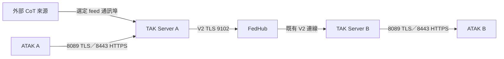

# TAK Server 與 FedHub 的 Mission、Data Feed 管理

本頁以 TAK Server 與 FedHub `5.8-RELEASE-84` 為準，說明如何讓兩個 TAK 網域共享指定 Mission 與 Data Feed。先完成[憑證、FedHub policy、群組與 V2 連線](federation-hub.md)。**本專案目前沒有部署 FedHub，`runtime/tak/CoreConfig.xml` 也未定義 Data Feed；以下是設定與驗收指引，並非已完成的跨網域實測。**

## 先分清楚資料類型

| 名稱 | 在本頁的意義 | 主要管理位置 |
| --- | --- | --- |
| Data Sync Mission | TAK Server 上的協作任務，含訂閱者、地圖項目、檔案及可能的 feed 關聯 | 各 TAK Server 的 **Mission Manager**、Data Sync 用戶端或 Mission API |
| Data Feed | 有名稱的 CoT 資料來源；5.8 介面分為 **Streaming**、**Plugin**、**Federation** 三類 | 各 TAK Server 的 **Configuration → Inputs and Data Feeds** |
| Virtual Bounding Mission（VBM） | 使用 Mission 的範圍框與訂閱關係，篩選送給用戶端的 Data Feed 訊息 | TAK Server 的 **Administrative → VBM Configuration**，以及 Mission 設定 |
| Mission Package／Data Package | 可包含檔案的套件；V2 federation 傳送 Mission Package 時另需可用的 HTTPS `webBaseUrl` | TAK Server 的檔案與 Federation 設定 |
| TAK Voice 的 Vx Mission | ATAK 下載 Vx DPK 後，在 TAK Voice 顯示的頻道設定 | [Vx 任務與頻道](../atak/vx-missions.md)；不能將它當成 Data Sync Mission 權限設定 |

**FedHub 不取代 Mission Manager 或 Data Feed 管理。**它依伺服器身分、active policy 的單向箭頭及訊息群組篩選路由資料；Mission 的成員與角色、feed 的建立及其 `Federated` 欄位仍由 TAK Server 管理。A 連到 Hub 時，`Edit Missions` 控制的是 **A → Hub** 這條連線。若 Hub 再把資料轉給 B、C，不能把 A 對 Hub 的 Mission 開關直接視為只核准 B。對下游目的地還須核對 Hub policy，並以 B、C 的實際接收結果驗證。

圖中的 feed 通訊埠只在建立 **Streaming Data Feed** 且外部來源必須連入時才新增；**Plugin Data Feed** 本身沒有獨立的網路 listener。Mission 或 Data Feed 在既有的 A → Hub → B V2 連線上交換時，不必另外為每個 Mission／feed 開一個 federation 通訊埠。Mission Package 的 HTTPS 需求另見下文。

| 連線 | 通訊埠 | 何時開放 |
| --- | --- | --- |
| 外部 CoT 來源 → A 的 Streaming Data Feed | 管理者選定的 `<feed-port>/TCP` 或 `<feed-port>/UDP` | 建立該 feed 且來源在容器外時，依表單協定新增 Compose 映射及限定來源的防火牆規則；沒有通用固定埠 |
| A、B → FedHub | Hub `9102/TCP` | V2 federation；沿用[連線總覽](federation-hub.md)的規則 |
| Mission Package HTTPS | 各 TAK Server `8443/TCP` | 依 `webBaseUrl` 公告位址及實際傳送方向，驗證伺服器間可達性 |
| ATAK → 各自 TAK Server | `8089/TCP`、視 API／檔案需求使用 `8443/TCP` | 用戶端連自己的 TAK Server，不連 FedHub |

FedHub 管理頁 `9100/TCP` 只供管理網段；若啟用 Hub 端 MFDT，MongoDB `27017/TCP` 只供內部服務存取。不要為了讓 feed 跨 Hub 傳送，就把來源 feed listener 也開在 FedHub。

## 權限要在哪一層設定

| 層次 | 具體控制 | 管理重點 |
| --- | --- | --- |
| 來源 TAK Server | Mission 群組、訂閱者與角色、內容群組；Data Feed 的驗證方式、`Filter Groups`、`Federated` | 先限制誰可建立、寫入、訂閱與發布；feed 預設值須逐筆讀回 |
| 來源 TAK federation | 全域 Mission／Data Feed 開關；對 Hub 的 `Edit Missions` 預設值與逐筆例外；檔案副檔名阻擋 | 只放行核准的 Mission 與 feed，並測試未核准項目不會外送 |
| FedHub | CA Group、active policy、A → B／B → A 箭頭、訊息群組篩選 | 每個方向分開核准；Mission 逐筆放行與接收端訂閱權限仍須在 TAK Server 管理 |
| 接收 TAK Server | Federate inbound group／mapping、Mission 訂閱與本地群組權限、收到的 Federation Data Feed | 確認遠端資料落入預期群組，只由核准用戶端讀取 |

FedHub 指南將 `Allowed Groups` 等選項描述為**訊息篩選**。不要只憑 policy 箭頭推定 Mission 成員、套件檔案與 feed 都受同一套規則約束；以下驗收要分別測 CoT、Mission 更新、Mission 檔案與 feed。

一般 CoT 訊息從來源到接收者會經過「A 本地權限 → A 對 Hub 的 outbound group → Hub 的 A → B 箭頭及群組條件 → B 的 inbound group／mapping → B 用戶端讀取權限」。[Federation Hub 串接](federation-hub.md)列出每一關的判斷及允許／拒絕範例。Mission、套件檔案及 feed 還要檢查本頁各自的開關，並分別實測。

## 一、設定 Data Sync Mission

1. 在來源 TAK Server 的 **Situation Awareness → Mission Manager** 或 Data Sync 用戶端建立 Mission。記錄名稱、用途、擁有者、群組、公開／限制狀態，以及核准的訂閱者與角色。接收端也要檢查誰能看到、訂閱與修改收到的 Mission。Mission 的公開狀態不等於「僅可傳給指定網域」。
2. 在 **Configuration → Federation → Edit Configuration** 啟用 federation V2，按需求啟用 **Allow Mission Federation**。這是全域開關；沒有跨網域 Mission 需求時關閉。若要採「只傳公開 Mission」，5.8 XSD 另有 `federateOnlyPublicMissions`，其預設為 `false`；部署前須在實際管理介面／`CoreConfig.xml` 讀回，並測公開與非公開 Mission。不要把「公開」當成機密分類或對方使用者身分的替代控管。
3. 在 **Configuration → Federation** 的 federate 列表，對與 Hub 的連線選 **Edit Missions**。將 **Default value** 明確設為 `False`，再把已核准 Mission 的值逐一設為 `True`。此預設值也套用新增、未列入例外的 Mission；5.8 XSD 的 `missionFederateDefault` 預設為 `true`，所以不能只靠省略設定達成預設拒絕。介面的 **Show VBM missions only** 只是清單篩選，儲存前應關掉篩選並核對全部 Mission。
4. 在同一 federate 的 **Edit Groups** 設定 outbound／inbound group 與 remote → local mapping。`Outbound Groups` 決定分享哪些本地群組的資料；`Inbound Groups` 決定收到的訊息交給哪些本地群組。若啟用 mapping，未命中群組時是否 fallback 由設定決定；要做嚴格分流時，明確檢查 `fallbackWhenNoGroupMappings` 與反向流量。群組映射與 Mission 訂閱須分別驗證。
5. 若會傳 Mission Package，將來源 TAK Server 的 `federation-server webBaseUrl` 設為對方實際可解析、可路由、憑證 SAN 相符的 `https://<server-fqdn>:8443/Marti`。5.8 管理介面明示此欄位為 **V2 傳送 Mission Package 必要設定**。本專案目前指向 Docker 內部位址（以 `https://<docker-private-ip>:8443/Marti` 表示），不能直接作跨主機位址。除 FedHub `9102/TCP` 外，還須依實際檔案傳送流程驗證相關伺服器間的 `8443/TCP` 可達；不要把 `8443` 誤當成 federation listener。
6. 按需啟用 **Data Package and Mission File Filter**，在阻擋清單加入應禁止的副檔名，例如 `pref`。本機 `CoreConfig.xml` 已列出 `pref`，但尚未明確啟用此 filter。`Allow Federated Delete` 的 5.8 XSD 預設為 `false`；若沒有跨網域刪除程序，維持關閉。

### 本地 Mission 權限的進階控制

下列是 TAK Server 5.8 `CoreConfig.xsd` 中 `<network>` 的設定鍵。它們控制**本地** Mission 作業，不能當成 FedHub 的逐筆 policy。表列為 XSD 預設；本機 `CoreConfig.xml` 未明列這些鍵，實際生效值仍應在部署後讀回並測試。編輯 `CoreConfig.xml` 前先備份，並依版本的設定程序重新啟動、確認服務健康。

| 設定鍵 | XSD 預設 | 使用時機與驗收 |
| --- | --- | --- |
| `MissionCreateGroupsRegex` | 未設定 | 以群組名稱規則限制誰可建立 Mission；測允許與拒絕群組 |
| `MissionDeleteRequiresOwner` | `false` | 設為 `true` 時限制刪除者須有 `MISSION_OWNER` 角色；測一般訂閱者不可刪除 |
| `MissionUseGroupsForContents` | `false` | 設為 `true` 時 Mission 內容套用 Mission 的群組，而非上傳者群組；變更可能改變既有資料可見範圍，先測讀寫權限 |
| `MissionAllowGroupChange` | `false` | 是否允許變更既有 Mission 及其內容的群組；正式環境若啟用，須有變更紀錄與反向測試 |
| `MissionStrictUidMissionMembership` | `true` | 限制 Mission 地圖項目只在該 Mission 脈絡使用；不要為了方便共享而逕自關閉 |

## 二、設定 Data Feed

1. 在來源 TAK Server 開啟 **Configuration → Inputs and Data Feeds**。**Create Streaming Data Feed** 適用外部 CoT 來源連入：指定唯一名稱、協定、驗證方式、通訊埠、`Filter Groups`、`Archive`、`Archive Only`、`Sync`、`Sync Cache Retention` 及 `Federated`。優先使用可驗證來源身分的 TLS／X.509；選 `Archive Only` 前，先確認是否仍要即時送給用戶端。通訊埠需與來源端協定一致，並同步設定 Docker `ports`、主機防火牆和來源 IP 範圍；例如已有 `8089` 的 ATAK 連線，不代表新 feed 通訊埠已開放。
2. 若資料由 TAK Server plugin 產生，使用 **Create Plugin Data Feed**，設定名稱、`Filter Groups`、`Archive`、`Sync`、`Federated`，並另行管理 plugin 的來源權限與執行設定。此 feed 本身不要求在 Compose 新增 listener 埠。
3. 在來源端逐筆確認 `Federated`。TAK Server 5.8 `CoreConfig.xsd` 的基底 input `federated` 預設為 `true`；若某筆 feed 不應外送，**明確設為 `False` 並讀回**。同時在 **Federation → Edit Configuration** 只於需要時開啟 **Allow DataFeed Federation**；5.8 XSD 對此全域開關的預設也是 `true`。全域開關與逐筆欄位均應納入驗收。
4. 在接收端的 **Inputs and Data Feeds** 檢查 **Federation Data Feeds**，確認名稱、資料來源與 `Archive`／`Archive Only`／`Sync` 狀態。這類項目是從 federation 收到的 feed；5.8 的編輯畫面沒有來源端 `Federated` 欄位，停止外送應回來源 TAK Server 與 Hub policy 處理。不要把接收端項目當成另一個需要對外開埠的 Streaming Data Feed。
5. 若 feed 要與特定 Data Sync Mission 一起使用，另外檢查 Mission 的 feed 關聯、訂閱者和群組；**`Federated=True` 不會自動完成 Mission 訂閱授權**。官方 TAK Server 原始碼有將 feed 加到 Mission 的獨立流程，且該流程同時檢查 Mission 與 Data Feed federation 開關；本專案的 5.8 實例尚未驗證此路徑，因此要用來源及接收端的 Mission／feed 清單與實際 CoT 訊息確認。

| Feed 欄位 | 設定判斷 |
| --- | --- |
| `Protocol`／`Authentication Type`／`Port` | 只屬於 Streaming Data Feed 的來源連入設定。選定協定後，從實際來源端測連線與驗證；不要只檢查 TAK 容器內有 listener。 |
| `Filter Groups` | 指定哪些本地群組可存取 feed；表單接受零個或多個群組。用一個允許群組和一個禁止群組做讀取測試。 |
| `Archive`／`Archive Only` | 分開決定是否保存及是否只供封存用途；若預期現場裝置收到即時 CoT，務必測 `Archive Only` 的實際投遞結果。 |
| `Sync`／`Sync Cache Retention` | 影響 feed 的同步與快取時間；`Sync Cache Retention` 以秒計。它不是 Mission 的斷線補送時間，也不是 FedHub MongoDB 留存天數。 |
| `Federated` | 每筆 feed 是否允許 federation 的控制；與全域 `Allow DataFeed Federation`、Hub policy、接收端群組一起核對。 |
| `Tags` | 用於辨識與整理 feed；授權仍依上述欄位及群組驗證，勿把標籤當成權限規則。 |

### VBM：依範圍框送出 feed 訊息

官方 5.8 指南說明：啟用 **Administrative → VBM Configuration → Enable VBM** 後，Data Feed 訊息只有在 Mission 的範圍框內，才會交給**已訂閱該 Mission** 的用戶端。`Disable SA Sharing`、`Disable Chat Sharing` 是 VBM 開啟時的相關選項。若要使用此模式，先建立範圍框、讓測試用戶端訂閱 Mission，分別送出框內與框外訊息，再測未訂閱者。VBM 是資料分流條件；跨網域授權仍須經過 Mission、feed、群組及 FedHub policy。未啟用 VBM 時，不能以範圍框推論一般 Data Feed 已受空間限制。

## 三、設定 FedHub 與斷線補送

1. FedHub **Policy Editor** 中，為來源與接收網域各建 CA Group，只畫核准方向的箭頭。`Allowed Groups`、`Disallowed Groups` 及兩者合用是訊息群組篩選；來源 TAK Server 必須執行 group mapping 才能使用非 **Allow All Messages** 的篩選。儲存並啟用 policy 後，檢查 Active Connections。若 B、C 的 Mission 範圍不同，將各目的地的箭頭與群組分開審查，並做交叉驗收。
2. TAK Server 的 **Enable Mission Federation Disruption Tolerance** 可在 federation 中斷後補送 Mission 更新。5.8 介面可設全域時間、`Unlimited` 與個別 Mission 的例外；時間愈長，重連後資料量可能愈大。若按 **Clear Federation Events**，下次重連會依補送上限重新傳送，因此應列入維運紀錄。
3. FedHub 若也要保存中斷期間的 Mission federation 事件，需啟用 `federation-hub-broker.yml` 的 `missionFederationDisruptionEnabled` 並配置僅供內部連線的 MongoDB。官方 FedHub 5.8 Docker 設定範例目前為 `false`、`missionFederationDBRetentionDays: 7`、`missionFederationRecencySeconds: 43200`。`27017/TCP` 只給 Hub 與資料庫之間使用，不要發布給 ATAK。

**補送時間的版本差異：**TAK Server 5.8 指南文字寫「預設 2 天」，但本機 5.8 `CoreConfig.xsd` 的預設及目前 `CoreConfig.xml` 的明確值都是 `43200` 秒（12 小時）；FedHub Docker 範例也是 12 小時。實際部署以管理介面讀回及設定檔為準，不要沿用指南敘述直接推算留存或頻寬。

## 四、最小驗收清單

以 A 發布、B 接收為例，先建立兩個測試 Mission（只核准其中一個）、兩筆 feed（只核准其中一筆）與一個禁止群組，記錄每項設定的讀回值。

| 測試 | 預期結果 |
| --- | --- |
| A 的核准 Mission 更新、地圖項目與檔案 | B 的核准訂閱者收到；Mission Package 另測 `8443` 與 `webBaseUrl` |
| A 的未核准 Mission 與新增 Mission | B 不收到；驗證 **Edit Missions → Default value=False** |
| A 的 `Federated=True` feed 與 `Federated=False` feed | 只有核准 feed 在 B 的 Federation Data Feeds／訊息觀察中出現 |
| 禁止群組、未訂閱者、VBM 框外訊息 | 依各自的群組、訂閱與 VBM 規則被拒絕；不要只看連線狀態 |
| B → A 的反向資料 | 未建立反向箭頭時不應流回；若有反向業務需求，另行核准與測試 |
| 中斷後重連 | Mission 更新只在設定的 MFDT 時間範圍內補送；檢查重複、延遲與檔案傳送 |

每次變更保留 Mission 名稱、feed 名稱、來源／目的網域、群組、policy 版本、核准人、設定讀回值與測試時間。停止共享時，先關來源端逐筆放行與 Hub 對應箭頭，發布新 active policy，再驗證新資料不再到達；接收網域應依約定處理已送達的副本。

## 依據與適用範圍

- 本機官方文件：`<OFFICIAL_TAK_DOWNLOAD_DIR>/Doc/TAK_Server_Configuration_Guide_5.8.pdf`，VBM 第 42–43 頁、Federation 第 44–52 頁；同一目錄的 `Federation_Hub_Configuration_Guide_5.8.pdf`，FedHub 設定與 policy 第 9–15 頁。`<OFFICIAL_TAK_DOWNLOAD_DIR>` 代表存放官方 TAK 套件的本機資料夾；頁碼為文件印製頁碼。
- 本機 5.8 套件：`vendor/takserver-docker-hardened-5.8-RELEASE-84/tak/CoreConfig.xsd`；`takserver.war` 中的 `Marti/federation/partials/modifyFederationConfig.html`、`federateMissions.html` 及 `Marti/inputs/partials/` Data Feed 表單；官方 FedHub Docker ZIP 中的 `federation-hub-broker.yml`。本專案現況以 `runtime/tak/CoreConfig.xml` 與 `compose.yaml` 讀回。
- 官方公開原始碼可輔助理解 [Mission federation](https://github.com/TAK-Product-Center/Server/blob/main/src/takserver-core/takserver-war/src/main/java/com/bbn/marti/sync/federation/MissionFederationAspect.java) 與 [Data Feed federation](https://github.com/TAK-Product-Center/Server/blob/main/src/takserver-core/takserver-war/src/main/java/com/bbn/marti/sync/federation/DataFeedFederationAspect.java) 的分開處理；公開 `main` 不等同本機 5.8 發行版，實際行為仍須按上列案例驗收。
